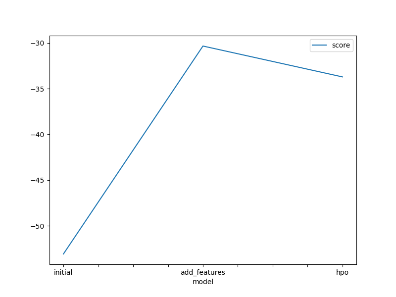
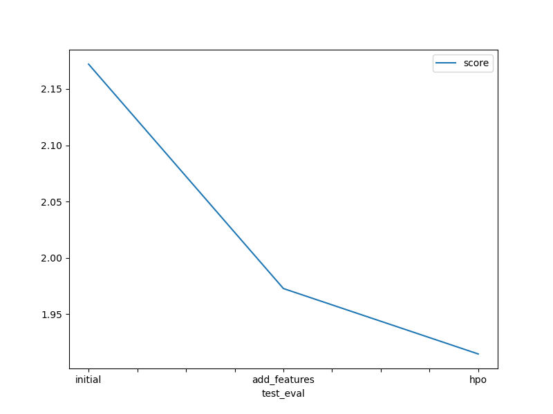

# Report: Predict Bike Sharing Demand with AutoGluon Solution
#### NAME HERE

## Initial Training
### What did you realize when you tried to submit your predictions? What changes were needed to the output of the predictor to submit your results?
TODO: I had to remove negative values before submission. I had to set them to zero.

### What was the top ranked model that performed?
TODO: WeightedEnsemble_L3 wa the top ranked model

## Exploratory data analysis and feature creation
### What did the exploratory analysis find and how did you add additional features?
TODO: The EDA revealed patterns of bike demand with each of the features. I extracted hour, day and month from the datetime column.

### How much better did your model preform after adding additional features and why do you think that is?
TODO: The model performance was improved by 42% after adding additional features. The model  gained by more granular information, increased complexity and possibly reduce overfitting.

## Hyper parameter tuning
### How much better did your model preform after trying different hyper parameters?
TODO: The model performance degraded slightly after trying different hyper parameters.

### If you were given more time with this dataset, where do you think you would spend more time?
TODO: I would have added more features and trying tuning different hyperparameters

### Create a table with the models you ran, the hyperparameters modified, and the kaggle score.
|model|hpo1|hpo2|hpo3|score|
|--|--|--|--|--|
|initial|default vals|default vals|default vals|2.1720|
|add_features|default vals|defaults vals|default vals|1.9728|
|hpo||GBM (Light gradient boosting) : num_boost_round: [lower=100, upper=500], num_leaves:[lower=6, upper=10]|XGB (XGBoost): n_estimators : [lower=100, upper=500], max_depth : [lower=6, upper=10]|CAT (CATBoost) : iterations : 100, depth : [lower=6, upper=10]|1.9147|

### Create a line plot showing the top model score for the three (or more) training runs during the project.

TODO: Replace the image below with your own.

### Create a line plot showing the top kaggle score for the three (or more) prediction submissions during the project.

TODO: Replace the image below with your own.

## Summary
TODO: Add your explanation

The "initial" model achieved a score of 2.172.
The "add_features" model achieved an improved score of 1.9728.
The "hpo" model, after hyperparameter tuning, achieved the best performance with a  score of 1.9147.
